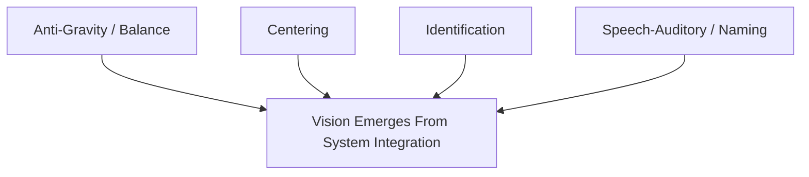

# Masters, Rules, and OEP Module

## Purpose

This module captures major international binocular vision thinkers, influential prescribing rules,
and OEP-related conceptual diagrams.

It is intentionally separate from the main `Stable Core` because:

- some content is strong clinical tradition but not universal consensus
- some content is evidence-supported in narrow contexts
- some content is conceptual and educational rather than directly diagnostic

Use this module to enrich interpretation, not to replace the main binocular vision framework.

## Master Layer

### 1. Arthur M. Skeffington

Role:

- central historical figure in OEP / behavioral optometry
- emphasized that vision emerges from broader sensorimotor organization

Why he matters here:

- helps explain why binocular vision symptoms are not just "eye muscle numbers"
- useful for developmental / functional interpretation

Evidence status:

- historical and conceptual influence: `A` within OEP history
- direct modern diagnostic authority for prism prescribing: `D`

Primary source anchors:

- OEPF history and about pages
- OEPF texts such as *Introduction to Clinical Optometry* and *Practical Applied Optometry*

### 2. J. James Sheedy

Role:

- major contributor to fixation disparity analysis and binocular stress interpretation

Why he matters:

- linked phoria, vergence, fixation disparity, symptoms, and treatment thinking
- fixation disparity curve logic remains clinically influential

Evidence status:

- important clinical research contributor: `B`

Primary source anchors:

- Sheedy & Saladin 1977
- Sheedy 1980 fixation disparity analysis

### 3. Bruce J.W. Evans

Role:

- modern evidence-oriented binocular vision and decompensated heterophoria authority

Why he matters:

- bridges classic optometric binocular vision methods with more modern clinical evidence
- useful when weighing Mallett, Sheard, prism prescribing, and reading outcomes

Evidence status:

- major modern clinical synthesis contributor: `B`

Primary source anchors:

- O'Leary & Evans 2006 randomized prism / reading trial
- Evans and collaborators on Mallett / aligning prism literature

### 4. Kenneth J. Ciuffreda

Role:

- influential binocular vision, oculomotor, and vision rehabilitation scholar

Why he matters:

- especially relevant when special populations like concussion or neuro-rehabilitation enter the frame

Evidence status:

- major modern binocular vision and rehabilitation contributor: `B`

Primary source anchors:

- Ciuffreda 2017

## Rule Layer

### Sheard's Criterion

Clinical idea:

- the opposing fusional reserve should be at least twice the phoric demand

Most clinically aligned use:

- more useful for exo-oriented discomfort logic than as a universal rule
- can guide prism thinking in symptomatic exophoria / CI-like patterns

Evidence reading:

- clinically influential and still widely cited
- not a universal predictor of comfort
- should not override symptoms, fixation disparity data, or broader pattern analysis

Evidence status:

- `B/C` depending on the specific use case

Prism implication for exo:

- can be used as a rough prism-prescribing anchor in symptomatic exophoria, but should be treated as one decision aid among several

### Percival's Criterion

Clinical idea:

- the demand point should fall in the middle third of the vergence range

Most clinically aligned use:

- historically linked more to eso-type logic
- sometimes invoked when considering prism for esophoric or reserve-balance problems

Evidence reading:

- less robust than many clinicians assume
- often weaker than Sheard for discriminating symptomatic exo cases

Evidence status:

- `C/D`

Prism implication for eso:

- may offer a conceptual guide in some esophoric cases, but should not be treated as a hard prescribing law

## Fixation Disparity / Associated Phoria Layer

### Mallett / Aligning Prism Logic

Clinical idea:

- associated phoria or aligning prism attempts to find the prism that neutralizes fixation disparity under more natural binocular conditions

Why clinicians value it:

- feels closer to everyday viewing than dissociated phoria alone
- often used in suspected decompensating heterophoria

What the evidence says

- associated phoria and dissociated phoria do not perfectly predict comfortable prism
- heterophoria and associated phoria alone are not reliable universal guides to prism prescribing
- aligning prism can correlate with fusional reserve stress in some exo-related near cases
- prism effects can be meaningful, but adaptation and individual variability matter

Evidence status:

- `B` as a clinically useful tool
- not `A` as a universal prescribing gold standard

Practical interpretation:

- useful especially when symptoms, reserve stress, and fixation disparity all point in the same direction
- weak when used in isolation

## OEP Figure Layer

### OEP / Skeffington Circles

Use:

- conceptual map for developmental / behavioral binocular vision thinking
- not a normative diagnostic chart

Core domains often described in the modern OEP explanation:

- Anti-Gravity / Balance
- Centering
- Identification
- Speech-Auditory / Naming

Why it belongs in this skill:

- it reminds us that some binocular vision problems are embedded in wider postural, attentional, and sensorimotor organization
- especially useful in pediatric / developmental interpretation and in patient education

Evidence status:

- conceptual / educational framework: `D`

### Text Diagram

### Clinical Warning

Do not use OEP diagrams as if they were equivalent to:

- binocular vision cutoffs
- prism prescribing formulas
- randomized treatment evidence

They are best used to widen interpretation, not replace measurement.

## Working Summary

### For Exophoria Prism Thinking

Most defensible order of thought:

1. confirm symptom pattern
2. confirm exo-related BV pattern
3. evaluate PFV stress and broader pattern
4. use Sheard as a support tool, not the sole rule
5. consider fixation disparity / associated phoria if clinically relevant

### For Esophoria Prism Thinking

Most defensible order of thought:

1. confirm eso-related pattern
2. examine NFV stress, task demand, and accommodation links
3. treat Percival as a secondary conceptual aid, not a hard law
4. escalate caution if manifest deviation, age-related factors, or special-population concerns are present

## Source Anchors

- OEPF About and History pages
- OEPF article on Skeffington's circles
- OEPF book listings for *Introduction to Clinical Optometry* and *Practical Applied Optometry*
- Sheedy & Saladin 1977
- Sheedy 1980
- Kommerell et al. 2000 review
- Schroth et al. 2008 comfortable prism study
- Evans et al. / O'Leary & Evans reading-prism literature
- PLOS One 2012 Mallett / aligning prism correlation paper

## Change Log

### 2026-04-13

- created masters, rules, and OEP module
- separated historical influence, conceptual frameworks, and evidence-supported clinical tools
