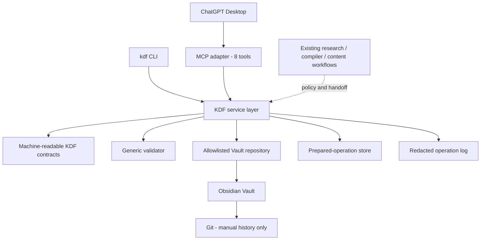

# KDF ChatGPT Bridge v0.1 Architecture (Frozen)

- Status: `FROZEN`
- Frozen on: 2026-08-13
- Audit authority: `CHATGPT-BRIDGE-AUDIT.md`
- Runtime: TypeScript, Node.js 22+, local STDIO
- Front door: ChatGPT Desktop or another local MCP client
- Source of truth: `obsidian-vault/`

## 1. Scope

v0.1 proves one bounded chain:

```text
ChatGPT Desktop
  -> KDF-only MCP adapter
  -> one KDF service layer
  -> validation and safe-write boundary
  -> allowlisted Obsidian Vault paths
```

The same service layer is used by the local `kdf` CLI. The Bridge has no Web UI,
HTTP listener, remote deployment, database, vector store, publisher, generic shell,
generic filesystem tool, Git mutation, or embedded model.

## 2. Frozen decisions

1. The Bridge is a new isolated package at `mcp-servers/kdf-chatgpt-bridge/`.
2. The local transport is STDIO.
3. Capture is an Inbox envelope, one Markdown file per capture.
4. Runtime logs and prepared-operation payloads are local and Git-ignored.
5. Higher-risk writes use `prepare/check -> save`.
6. Uncle Lens material cannot become a confirmed human perspective without an
   explicit Human Gate.
7. Legacy MCP, legacy MCP config, auto-push, and old sync automation are outside
   this change.

## 3. Component boundary



### MCP adapter

- declares exactly eight focused tools;
- defines explicit Zod input/output schemas and accurate annotations;
- maps requests to service methods;
- returns structured results and safe error codes;
- never edits Markdown directly.

### CLI adapter

- maps local commands to the same service methods;
- returns JSON to stdout;
- never owns validation or write logic.

### Service layer

- indexes cards, searches, reads, and calculates backlinks;
- validates KDF contracts and Human Gates;
- allocates IDs under a lock;
- creates captures and low-risk objects;
- prepares and saves higher-risk objects;
- coordinates expected hashes, locks, atomic writes, rollback, and redacted logs.

### Existing workflows

The knowledge compiler, research skills, and content workflows remain policy and
language-generation layers. The Bridge returns a traceable handoff bundle; ChatGPT
drafts candidate prose and sends it to the prepare phase. The Bridge does not
reimplement those workflows and does not call another model.

## 4. Canonical validation

The machine-readable contracts are:

- `docs/kdf-engine/schemas/kdf-contract-v0.1.json`
- `docs/kdf-engine/schemas/kdf-capture-v0.1.json`

The TypeScript generic validator is the canonical executable implementation.
`scripts/validate_kdf.py` is a compatibility launcher and contains no KDF business
rules. KDF-001 exact counts are a separate fixture regression, not generic rules.

```text
Generic validation
  - arbitrary KDF roots and artifact counts
  - metadata, type, ID, parent, relation, provenance, and Human Gate invariants

KDF-001 regression
  - KDF-001 subtree only
  - 17 artifacts, 9 templates, 162 Wikilinks
  - 0 errors, warnings, broken links, or orphans
```

## 5. Storage map

### Read allowlist

```text
obsidian-vault/04-知識卡片/
obsidian-vault/07-長篇專欄與企劃/KDF/
obsidian-vault/00-收件匣/KDF/
```

### Write allowlist

```text
obsidian-vault/00-收件匣/KDF/
obsidian-vault/04-知識卡片/KDF/
obsidian-vault/07-長篇專欄與企劃/KDF/
logs/kdf-bridge/
```

Capture files are not formal KDF artifacts and are excluded from KDF artifact
counts. Formal artifacts remain under the current KDF namespaces.

## 6. Two-phase write protocol

Prepare persists a short-lived, local operation record containing:

```text
operation_id
tool
target
proposed UTF-8 bytes
proposed SHA-256
expected current SHA-256 or null
generated_at
expires_at
validation preview
save_ready
```

Save accepts `operation_id` and the expected hash. It does not accept replacement
content. This prevents a caller from preparing one candidate and saving another.

```text
load prepared operation
-> verify tool, target, expiry, and proposed hash
-> resolve allowlisted target and reparse boundary
-> acquire target lock
-> re-read target and compare expected hash
-> write and fsync same-directory temp file
-> validate candidate and relations
-> rename temp over target
-> validate final Vault state
-> rollback on failure
-> append redacted operation result
-> release lock
```

## 7. Uncle Lens state mapping

The owner-facing Bridge state and the existing Vault schema are mapped without
adding new KDF status values:

| Bridge confirmation state | Vault fields |
| --- | --- |
| `pending_human_confirmation` | `status: waiting-human`, `human_confirmed: false`, `human_review: pending` |
| `confirmed` | `status: thinking`, `human_confirmed: true`, `human_review: approved`, non-empty `human_source` |

The Bridge may structure candidate wording but preserves the raw human text. A
pending source cannot make a Mature Knowledge prepare operation save-ready.

## 8. Capture identity and idempotency

Each capture is stored at:

```text
obsidian-vault/00-收件匣/KDF/CAP-<UTC timestamp>-<random>.md
```

`hash` is the SHA-256 of the raw UTF-8 user text, not a self-referential whole-file
hash. When `request_id` is supplied, a repeated request returns the existing capture.
The same request ID with different text is rejected as `INVALID_INPUT`.

## 9. Local ChatGPT boundary

Current official OpenAI documentation states that ChatGPT Desktop supports local
STDIO MCP servers and shares MCP configuration with Codex clients on the same host.
ChatGPT web uses remote MCP-backed plugin tools instead. See
[Model Context Protocol](https://learn.chatgpt.com/docs/extend/mcp).

The adapter follows current OpenAI guidance to expose one focused tool per user
goal, explicit schemas, stable identifiers, structured content, and accurate safety
annotations. See [Build an MCP server](https://developers.openai.com/plugins/build/mcp-server).

## 10. Non-goals and protected areas

The implementation does not modify:

- `mcp-server/uncle-glasses/**`;
- `mcp-servers/uncle-glasses-mcp/**`;
- `plugins/claude/uncle-glasses/.mcp.json`;
- old auto-push or sync scripts;
- existing KDF knowledge artifacts;
- unrelated Obsidian notes, applications, or production deployment configuration.
