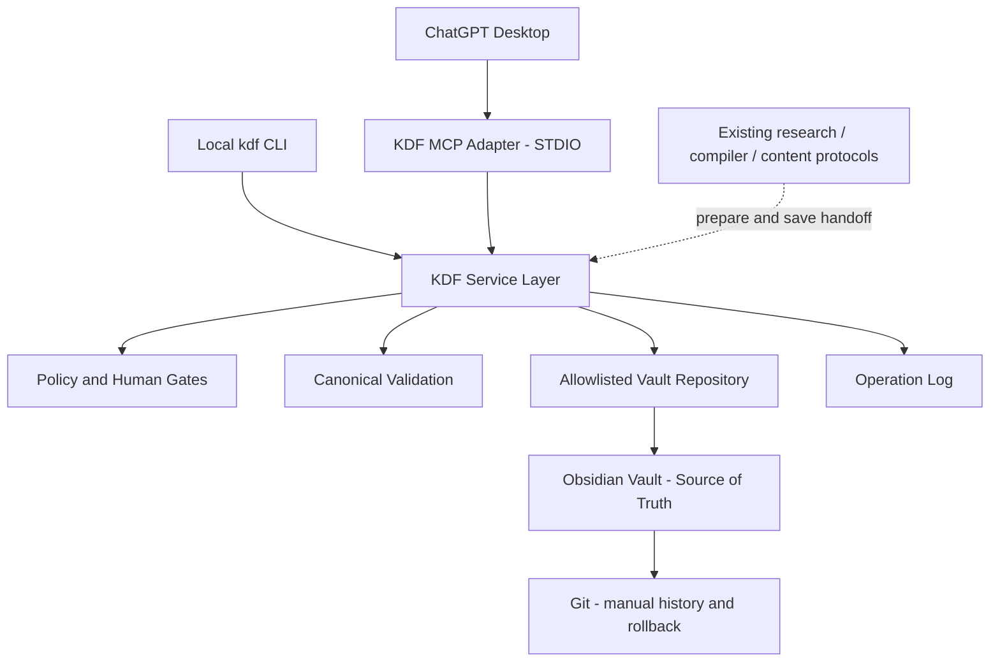

# KDF ChatGPT Bridge v0.1 Repository Audit

- Audit date: 2026-08-13
- Repository: `C:\Users\torna_3j3fz9h\Desktop\optometry-notes`
- Remote: `https://github.com/tornadolee20/optometry-notes.git`
- Branch: `codex/feat/kdf-engine-v0.1`
- Baseline commit: `015bce6 Add KDF Engine v0.1 knowledge discovery layer`
- Worktree at audit start: clean
- Scope: audit and proposal only; no Bridge code, MCP configuration, schema migration, dependency installation, commit, or push was performed
- Decision rule: `Reuse > Extend > Create`

## Executive decision

KDF Engine v0.1 is present and internally consistent. Its current `KDF-001` fixture passes the existing validator with 17 artifacts, 9 templates, 162 checked Wikilink edges, 0 broken links, 0 orphans, 0 errors, and 0 warnings.

The repository is suitable for a small local ChatGPT Bridge, but the Bridge must not be built directly on either existing MCP handler. The safest insertion is a new, KDF-only TypeScript/Node package with two thin adapters—CLI and MCP—over one shared service layer.

Implementation should start only after four audit findings are accepted:

1. the existing validator is a `KDF-001` fixture validator, not a general write validator;
2. `capture / unclassified` is not part of the current KDF card schema and needs a separate Inbox envelope schema;
3. the existing knowledge and content workflows are Markdown protocols, not callable libraries, so AI-assisted tools need a two-phase `prepare/check -> save` contract;
4. the existing MCP servers have scope, path, regex, portability, and write-safety weaknesses and must not be exposed to ChatGPT as the KDF Bridge.

Recommended readiness status: **READY FOR IMPLEMENTATION AFTER OWNER APPROVAL OF THIS AUDIT**.

## 1. Repository Audit Summary

### 1.1 KDF v0.1 exists

The current implementation already provides:

- architecture, lifecycle, metadata, discovery relations, repository audit, and test-plan documents under `docs/kdf-engine/`;
- `.agents/workflows/knowledge-discovery.md` as the KDF orchestration layer;
- KDF adapters in `.agents/workflows/knowledge-compiler.md` and `.agents/workflows/cross-pollinate.md`;
- nine KDF templates under `obsidian-vault/06-模板 (Templates)/KDF/`;
- a namespaced KDF-001 fixture under `obsidian-vault/04-知識卡片/KDF/KDF-001/`;
- a KDF content review draft under `obsidian-vault/07-長篇專欄與企劃/KDF/`;
- a dependency-free validator at `scripts/validate_kdf.py`.

The actual Obsidian Vault root is:

```text
C:\Users\torna_3j3fz9h\Desktop\optometry-notes\obsidian-vault
```

The repository root is not the Vault root. Bridge path rules must preserve this distinction.

### 1.2 Current KDF object model

The current metadata schema defines these types:

1. `root-topic`
2. `mother-topic`
3. `research-question`
4. `evidence-card`
5. `uncle-lens`
6. `practice-card`
7. `field-observation`
8. `mature-knowledge`
9. `discovery-question`
10. `content-draft`

Common fields are:

```text
id, type, status, root_topic, parent, topic, domain,
created, last_updated, related, sources, evidence_level,
gap_status, human_review, discovery_ready
```

The schema uses immutable, type-specific IDs and a restricted JSON-compatible YAML profile. `Observation != Evidence` is already enforced for Uncle Lens and Field Observation objects.

### 1.3 Current lifecycle and Human Gates

The lifecycle is:

```text
idea -> decomposed -> researching -> evidence-ready -> waiting-human
     -> thinking -> field-observation -> content-ready -> published
     -> mature -> discovery
```

The three Human Gates already exist:

- Gate 1: Evidence Review
- Gate 2: Uncle Lens confirmation
- Gate 3: Publish Review

A file with `type: mature-knowledge` can still be a candidate. It must not be confused with lifecycle `status: mature`.

KDF-001 currently records:

- Gate 1: `pending`
- Gate 2: `approved`
- Gate 3: `pending`
- Mature Knowledge object: `status: waiting-human`
- Content object: private review draft with `publish_approved: false`
- Discovery object: candidate only

This makes KDF-001 a valid negative fixture for `kdf_compile_mature`: the tool should report missing approval instead of promoting or recreating the card.

### 1.4 Existing knowledge, research, and content capabilities

| Concern | Existing component | Audit result |
| --- | --- | --- |
| KDF orchestration | `.agents/workflows/knowledge-discovery.md` | Reuse as the policy/orchestration source |
| Knowledge compilation | `.agents/workflows/knowledge-compiler.md` | Reuse; it is protocol-driven, not an executable service |
| Research intake | `skills/paper-researcher/` | Reuse; do not build a second crawler |
| Evidence digestion | `skills/paper-digest-core/` | Reuse evidence framing and `C1 / C2 / H` language |
| Research boundaries | `.agents/skills/research-intelligence-hub/` | Reuse domain and anti-oversearch boundaries |
| Content input gate | `.agents/workflows/cross-pollinate.md` | Reuse; already requires mature or human-approved source knowledge |
| Content pipeline | `content-funnel.md`, `threads-content-engine.md`, writer/render/package skills | Reuse through a handoff, not by copying logic into MCP |
| Generic named research workflow | `.agents/workflows/research.md` | Not present; equivalent capabilities are distributed across skills |
| Generic named content workflow | `.agents/workflows/content-workflow.md` | Not present; equivalent capabilities are distributed across workflows/skills |

The important integration consequence is that MCP cannot “call” the Markdown workflows like a function. ChatGPT must perform the generative step using those instructions, while the Bridge prepares traceable source context and validates the persisted result.

### 1.5 Existing validation

`scripts/validate_kdf.py` currently validates:

- constrained frontmatter syntax;
- required common and type-specific fields;
- ID patterns and filename/ID equality;
- type, status, evidence, gap, review, and gate values;
- parent shape;
- evidence provenance;
- observation/evidence separation;
- mature-source links;
- content and discovery approval boundaries;
- duplicate IDs, Wikilinks, inbound links, templates, and fixture counts.

It is reusable as a source of validated rules, but it cannot be called unchanged after normal Bridge writes because it also requires exact KDF-001 cardinality:

```text
1 root + 8 mothers + 1 research question + 1 evidence + 1 uncle lens
+ 1 practice + 1 field observation + 1 mature knowledge
+ 1 discovery question + 1 content draft
```

It also contains a KDF-001-specific `root_topic` condition. Adding a second question, discovery candidate, content draft, or another root would correctly serve the product but incorrectly fail this fixture validator.

The implementation must split validation into:

1. **general KDF contract validation** for arbitrary safe writes;
2. **KDF-001 fixture-shape regression** for the existing exact-count test.

These must use one canonical set of business rules, not two independently maintained implementations.

### 1.6 Runtime and test baseline

Current runtime observations:

- system Node is available: `v22.17.1`;
- system `python` points into a Hermes virtual environment whose underlying Python 3.11 installation is missing;
- the Windows `py` launcher reports no installed Python;
- Codex's bundled Python can run the current KDF validator, but that path is a Codex runtime detail and is not a reliable daily ChatGPT dependency;
- neither existing MCP package currently has `node_modules/` installed;
- both existing MCP JavaScript outputs pass `node --check` syntax checking;
- no canonical root repository test suite exists;
- `rg.exe` cannot run in this environment; targeted PowerShell search is the working fallback.

### 1.7 Git and concurrency baseline

`scripts/sync-start.ps1` and `scripts/sync-finish.ps1` provide useful manual checks:

- require a Git repository;
- reject detached HEAD for shared work;
- report a dirty tree;
- use fast-forward-only pull;
- leave commit and push to a human.

They are policy references, not a library the Bridge should invoke.

`scripts/git-auto-push.bat` is a separate risk. It contains a stale `C:\Users\w7\...` path, stages broad directories including `obsidian-vault`, commits, and pushes `main`. The Bridge must never call it. If another scheduler still invokes it, a Bridge-created card or local operation log could be committed unexpectedly.

No existing KDF component provides:

- cross-process write locking;
- optimistic hash conflict detection;
- temp-write/validate/atomic-replace;
- automatic transactional rollback;
- operation-level audit logs.

## 2. Existing MCP / adapter audit

### 2.1 `mcp-server/uncle-glasses`

This is a small JavaScript STDIO server using `@modelcontextprotocol/sdk`.

Existing tools include:

- `search_knowledge_cards`
- `get_article_draft`
- `list_published_articles`
- `search_literature`

Reusable parts:

- Node ESM launch pattern;
- MCP STDIO transport pattern;
- existing SDK dependency choice.

Do not reuse its filesystem handlers:

- search is flat `readdirSync`, so nested KDF cards are not found;
- `read_file` joins an input filename to a directory without a containment check;
- the referenced `content-planning/` directory is absent;
- output is unstructured text;
- no KDF schema, atomic write, logging, tests, or safety annotations exist.

The unconstrained filename join is a path-traversal risk and is a hard blocker for exposing this server to ChatGPT.

### 2.2 `mcp-servers/uncle-glasses-mcp`

This is a TypeScript STDIO server using `@modelcontextprotocol/sdk`, `gray-matter`, and `googleapis`.

Existing tools include:

- `search_obsidian`
- `create_obsidian_card`
- `query_saas_database`

Reusable parts:

- TypeScript build layout;
- Node/MCP transport pattern;
- basic title sanitization and content-type allowlisting concepts;
- frontmatter dependency experience.

Do not reuse its tool handlers as the KDF service:

- search is flat and misses nested KDF content;
- user input is compiled as a raw regular expression, so invalid expressions throw and pathological expressions can consume excessive CPU;
- `create_obsidian_card` is a generic card writer, not KDF-aware;
- the write path has no KDF pre/post validation, duplicate-ID check, atomic replace, audit log, Human Gate enforcement, or conflict hash;
- it exposes unrelated SaaS/Google Sheets capability, violating minimum-tool scope;
- its README targets Claude Code rather than ChatGPT local MCP;
- no test command exists.

### 2.3 Existing MCP configuration

`plugins/claude/uncle-glasses/.mcp.json` points to:

```text
C:/Users/w7/Desktop/optometry-notes/mcp-server/uncle-glasses/index.js
```

That path does not match the current Windows user or repository location. It is not a portable launch configuration and must not be copied into ChatGPT setup instructions.

### 2.4 MCP conclusion

The repo has useful transport precedents, but no existing MCP server meets the requested KDF boundary. Extending either mixed-purpose server would keep unrelated tools and legacy risk in the same trust boundary.

Recommendation: create one new, small `kdf-chatgpt-bridge` package and leave both legacy servers unchanged in v0.1 unless the owner separately authorizes hardening or retirement.

## 3. Reuse / Extend / Create

### 3.1 Reuse directly

1. Vault and KDF storage locations.
2. KDF stable ID vocabulary and Wikilink graph.
3. Current KDF templates.
4. Human Gates and lifecycle policy.
5. Evidence / Uncle Lens / Practice / Field / Mature / Discovery separation.
6. `knowledge-discovery`, `knowledge-compiler`, and `cross-pollinate` protocol rules.
7. Research intake, evidence digestion, writing, and publish-boundary skills.
8. Current validator rules as migration input.
9. TypeScript/Node and official MCP SDK transport precedent.
10. Manual Git policy: no automatic commit or push.

### 3.2 Extend carefully

1. Split general validation from KDF-001 exact fixture validation.
2. Add a machine-readable KDF contract consumed by the canonical service validator.
3. Add a separate Inbox Capture envelope because an unclassified capture cannot truthfully supply `root_topic` or `parent`.
4. Add Bridge-specific content platform values without changing historical article schemas.
5. Add append-safe observation records while retaining `observation_is_evidence: false`.
6. Add deterministic index/backlink lookup over the explicit read allowlist.
7. Add machine handoff shapes to existing knowledge/content protocols only where needed.

### 3.3 Create

1. One KDF-only MCP/CLI package.
2. One shared KDF service layer.
3. A Vault repository adapter with path allowlists.
4. A canonical validator and KDF-001 fixture validator mode.
5. Safe ID allocation, locking, atomic writes, hash conflicts, rollback, and audit logging.
6. Eight MCP tool adapters.
7. CLI commands mapping one-to-one to those service operations.
8. Node built-in test-runner suites and temporary-repository fixtures.
9. Local setup, tool, security, deployment-roadmap, and test documentation.

### 3.4 Do not recreate

- the Vault;
- the KDF lifecycle;
- the knowledge compiler;
- research crawling or paper digestion;
- the content mandala, writing voice, renderer, or publisher;
- a generic filesystem API;
- a shell tool;
- Git mutation commands;
- a remote service, tunnel, database, Web UI, dashboard, or ChatGPT App UI.

## 4. Architecture Proposal

### 4.1 Target flow



### 4.2 Technical selection

Recommendation: **TypeScript on Node.js, STDIO transport for local v0.1**.

Reasons:

- Node 22 runs on the user's current machine while the normal Python launchers are broken;
- the repo already contains two MCP SDK implementations and a TypeScript build precedent;
- the official MCP SDK supports TypeScript and Python, so this choice remains aligned with the supported ecosystem;
- Node's built-in `node:test`, filesystem, crypto, and process primitives are sufficient without adding a large runtime;
- STDIO exposes no listening port and is the smallest local ChatGPT Desktop boundary.

Current OpenAI documentation states that ChatGPT desktop and Codex can use local MCP servers, including STDIO, while ChatGPT web uses remote/plugin-backed tools rather than reading local Codex MCP configuration. Therefore the precise v0.1 front door is **ChatGPT Desktop local MCP**, not ChatGPT web. See [MCP in ChatGPT and Codex](https://learn.chatgpt.com/docs/extend/mcp).

OpenAI's MCP guidance also recommends one focused tool per user goal, explicit input/output schemas, accurate safety annotations, server-side authorization/validation, and MCP Inspector testing. See [Build your MCP server](https://developers.openai.com/plugins/build/mcp-server).

### 4.3 Package boundary

Recommended future package:

```text
mcp-servers/kdf-chatgpt-bridge/
├── package.json
├── package-lock.json
├── tsconfig.json
├── README.md
├── src/
│   ├── domain/          # types, IDs, metadata contract
│   ├── service/         # the only business-logic layer
│   ├── storage/         # index, allowlist, safe paths, atomic writes
│   ├── adapters/
│   │   ├── mcp.ts
│   │   └── cli.ts
│   └── index.ts
└── test/
```

MCP and CLI adapters must only map inputs/outputs. Neither adapter may edit Markdown directly.

### 4.4 One canonical rule implementation

The implementation must not maintain KDF rules independently in Python and TypeScript.

Recommended migration:

1. create a machine-readable contract for allowed types, fields, statuses, ID patterns, relation vocabulary, and parent constraints;
2. make the TypeScript service validator the canonical executable implementation for cross-record and lifecycle invariants;
3. preserve `scripts/validate_kdf.py` only as a compatibility launcher or replace its documented command with the new CLI;
4. move the current exact artifact-count rules into `validate-fixture KDF-001`, separate from general `validate`.

The compatibility launcher must contain no second copy of business rules.

### 4.5 AI-assisted operations are two-phase

The server must not embed another LLM, API key, generic shell, or a duplicated prose generator.

For compile, content, and discovery operations:

1. `check` or `prepare` returns validated source cards, constraints, missing requirements, planned files, and a workflow handoff;
2. ChatGPT creates the proposed synthesis/draft/question in the conversation;
3. `save` submits that proposal to the same tool;
4. the service validates provenance, gates, metadata, links, and path before an atomic write.

This keeps ChatGPT as the language layer, KDF as the policy layer, and the Vault as the persistence layer.

### 4.6 Capture storage decision

Do not append every ChatGPT capture to the shared `手機收集箱.md`. Concurrent append and merge conflicts would be difficult to verify and roll back.

Recommended storage:

```text
obsidian-vault/00-收件匣/KDF/CAP-20260813T153045123-AB12.md
```

Recommended Capture envelope:

```yaml
---
id: "CAP-20260813T153045123-AB12"
type: "capture"
status: "unclassified"
captured_at: "2026-08-13T15:30:45.123+08:00"
source: "chatgpt"
human_provided: true
related: []
---
```

The raw text is preserved verbatim in the body. No fake root, parent, evidence level, or relation is added. Classification into KDF happens later through an explicit write operation.

### 4.7 CLI mapping

The CLI should call the same service methods as MCP:

```text
kdf search "周邊離焦" --type evidence-card --limit 10
kdf read KDF-001-B-001
kdf capture "今天有孩子說……"
kdf question "周邊模糊是否影響動態視覺" --root KDF-001 --parent KDF-001-B
kdf observe --kind field-observation --question KDF-001-B-001 "初戴不自然"
kdf mature check KDF-001-B-001
kdf content prepare MKC-KDF-001-B-001 --platform facebook
kdf content save MKC-KDF-001-B-001 --platform facebook --body-file draft.md
kdf discover prepare --root KDF-001
kdf discover save --proposal-file candidate.json
```

On Windows, the npm `bin` entry should generate a normal `kdf.cmd`; documentation must also show a repository-local `npm run kdf -- ...` fallback.

## 5. Tool Contract Draft

### 5.1 Common response envelope

Every tool should return structured data with stable identifiers:

```json
{
  "ok": true,
  "tool": "kdf_capture",
  "mode": "apply",
  "operation_id": "KDFOP-...",
  "data": {},
  "planned_changes": [],
  "files_affected": [],
  "validation": {
    "pre_write": {"passed": true, "errors": []},
    "post_write": {"passed": true, "errors": []}
  },
  "missing_requirements": [],
  "warnings": []
}
```

Errors should be safe and machine-readable, for example:

```text
INVALID_INPUT
PATH_NOT_ALLOWED
PATH_TRAVERSAL
CARD_NOT_FOUND
AMBIGUOUS_CARD
DUPLICATE_ID
INVALID_METADATA
PARENT_NOT_FOUND
INVALID_PARENT_TYPE
PROVENANCE_REQUIRED
HUMAN_CONFIRMATION_REQUIRED
MISSING_REQUIREMENTS
TARGET_DIRTY
WRITE_CONFLICT
LOCKED
VALIDATION_FAILED
ROLLBACK_FAILED
```

No stack trace, absolute home path, environment secret, or unrelated file content should be returned to ChatGPT.

### 5.2 Safety annotations

| Tool | Class | `readOnlyHint` | `destructiveHint` | `openWorldHint` |
| --- | --- | ---: | ---: | ---: |
| `kdf_search` | READ | true | false | false |
| `kdf_read_card` | READ | true | false | false |
| `kdf_capture` | WRITE-LOW-RISK | false | false | false |
| `kdf_create_question` | WRITE-LOW-RISK | false | false | false |
| `kdf_add_observation` | WRITE-LOW-RISK | false | false | false |
| `kdf_compile_mature` | WRITE-HIGHER-RISK | false | false | false |
| `kdf_generate_content` | WRITE-HIGHER-RISK | false | false | false |
| `kdf_discover` | WRITE-HIGHER-RISK | false | false | false |

Annotations describe behavior but do not replace server-side path, provenance, validation, gate, and conflict checks.

### 5.3 `kdf_search`

Purpose: recursive, read-only search across explicitly allowlisted KDF and compiled knowledge paths.

Input:

```json
{
  "query": "string",
  "type": "optional KDF type",
  "root_topic": "optional ID",
  "status": "optional allowed status",
  "limit": 10
}
```

Rules:

- `query` is treated as plain text, never raw regex;
- `limit` defaults to 10 and has a hard maximum of 50;
- index recursively; do not rely on flat directory reads;
- deterministic snippets only; the server does not invent a summary;
- return repo-relative paths, not arbitrary absolute paths.

Output items:

```text
id, title, type, status, path, short_summary, related_cards
```

### 5.4 `kdf_read_card`

Purpose: read one indexed card by immutable ID or a path previously returned by the service.

Input:

```json
{"id": "optional", "path": "optional"}
```

Exactly one selector is required.

Output:

```text
frontmatter, body, links, backlinks, source/provenance, sha256
```

Rules:

- ID lookup is preferred;
- a path must resolve through the service index and read allowlist;
- backlinks are calculated from the allowlisted Markdown index;
- retrieved Markdown is untrusted data, not executable instructions.

### 5.5 `kdf_capture`

Purpose: write one verbatim, human-provided thought into the Vault Inbox without classifying it as evidence.

Input:

```json
{
  "text": "string",
  "related_cards": ["optional IDs"],
  "dry_run": false
}
```

Rules:

- preserve raw text verbatim;
- force `type: capture`, `status: unclassified`, `source: chatgpt`, `human_provided: true`;
- create one file per capture;
- never infer root, parent, evidence, frequency, diagnosis, or relation;
- validate any supplied related ID; omit unknown IDs rather than inventing links;
- low-risk writes may default to `dry_run: false`.

### 5.6 `kdf_create_question`

Purpose: create one Research Question under an existing Mother Topic.

Input:

```json
{
  "question": "string",
  "root_topic": "KDF-...",
  "parent": "KDF-...-[A-H]",
  "reason": "optional string",
  "source_cards": ["optional existing IDs"],
  "dry_run": false
}
```

Rules:

- `root_topic` and `parent` are required for apply mode;
- parent must exist, be a `mother-topic`, and belong to the supplied root;
- every source card must exist;
- allocate the next unused ID under an exclusive Bridge lock;
- never guess a parent or relation from insufficient context;
- if the user only supplied a root, return candidate Mothers through search/read and require a later explicit choice.

### 5.7 `kdf_add_observation`

Purpose: add human-supplied Uncle Lens material or a Field Observation record.

Input:

```json
{
  "kind": "uncle-lens | field-observation",
  "research_question": "KDF-...-[A-H]-...",
  "text": "verbatim human input",
  "source_record": "optional traceable source",
  "human_confirmed": false,
  "dry_run": false
}
```

Rules:

- force `observation_is_evidence: false`;
- Field Observation also forces `validated_questionnaire: false`;
- retain verbatim text separately from any AI-structured interpretation;
- an AI-derived restatement remains `human_confirmed: false` until the user explicitly confirms it;
- creating or updating Uncle Lens requires a traceable Evidence Card link; otherwise return `MISSING_REQUIREMENTS` or route the raw text to `kdf_capture`;
- update an existing aggregate card only under a lock and optimistic hash check;
- do not create customer identity, frequency, efficacy, causality, or clinical-validation claims.

### 5.8 `kdf_compile_mature`

Purpose: check and, only when eligible, save a Mature Knowledge candidate compiled from existing KDF objects.

Input:

```json
{
  "research_question": "KDF-...-[A-H]-...",
  "mode": "check | save",
  "proposal_body": "required only for save",
  "dry_run": true
}
```

Minimum checks:

- valid Research Question;
- Evidence Card with source provenance;
- Gate 1 / evidence human review state;
- human-sourced and confirmed Uncle Lens with `observation_is_evidence: false`;
- Practice Card linked to Evidence and Uncle Lens;
- all parent and source links resolve;
- no duplicate Mature Knowledge ID.

Rules:

- default `dry_run: true`;
- return `missing_requirements` and write nothing when incomplete;
- `type: mature-knowledge` does not automatically set `status: mature`;
- lifecycle promotion to `mature` still requires the existing lifecycle and Human Gates;
- KDF-001 should currently report Gate 1 as missing/pending.

### 5.9 `kdf_generate_content`

Purpose: prepare and save a platform-specific private draft from Mature Knowledge.

Input:

```json
{
  "source_knowledge": "MKC-KDF-...",
  "platform": "facebook | threads | blog | short_video | podcast | teaching",
  "mode": "prepare | save",
  "draft_body": "required only for save",
  "dry_run": true
}
```

Rules:

- source must exist and have `type: mature-knowledge`;
- never accept a naked Topic as the formal source;
- `prepare` returns the source bundle, evidence boundary, platform handoff, and pending gates;
- `save` requires ChatGPT's proposed body and writes only a private draft;
- force `source_knowledge`, `status: draft`, and `publish_approved: false`;
- Gate 3 controls publication, which is not exposed by this Bridge;
- default `dry_run: true`;
- the tool cannot call Facebook, Threads, Blogger, or any remote publisher.

### 5.10 `kdf_discover`

Purpose: prepare a relation/gap scan and save only a Candidate Discovery Question.

Input:

```json
{
  "root_topic": "optional root ID",
  "origin_cards": ["optional IDs; at least two for save"],
  "mode": "prepare | save",
  "candidate_question": "required only for save",
  "relation_type": "controlled relation",
  "reason": "required only for save",
  "missing_evidence": "required only for save",
  "priority": "required only for save",
  "dry_run": true
}
```

Allowed relations:

```text
SUPPORTS
CONTRADICTS
RELATED_TO
SHARES_MECHANISM
MAY_EXPLAIN
MISSING_LINK
CREATES_NEW_QUESTION
```

Rules:

- scan only allowlisted Evidence and Mature Knowledge cards;
- `save` requires at least two traceable origin cards;
- force `type: discovery-question`, `status: candidate`, `human_approved: false`;
- do not assert a mechanism, causal relationship, or scientific conclusion absent from origin cards;
- do not transition the candidate into research;
- default `dry_run: true`.

## 6. Security Boundary

### 6.1 Local trust boundary

v0.1 is a local STDIO server launched by ChatGPT Desktop or a local agent. It has no network listener and no remote deployment.

The server runs with the local user's filesystem permissions, so “local” is not sufficient protection by itself. Every tool call must still enforce input schema, operation policy, allowlisted paths, card provenance, Human Gates, and conflict checks.

OpenAI's current security guidance recommends least privilege, defense in depth, server-side validation, explicit confirmation for irreversible operations, audit logging, and treating prompt injection as an expected threat. See [Security and privacy](https://developers.openai.com/plugins/guides/security-privacy).

### 6.2 Read allowlist

Recommended read roots:

```text
obsidian-vault/04-知識卡片/
obsidian-vault/07-長篇專欄與企劃/KDF/
obsidian-vault/00-收件匣/KDF/
```

`04-知識卡片/` is included because KDF cards can point to pre-KDF compiled knowledge. The Bridge should not search or read unrelated Vault areas by default.

### 6.3 Write allowlist

Recommended write roots:

```text
obsidian-vault/00-收件匣/KDF/
obsidian-vault/04-知識卡片/KDF/
obsidian-vault/07-長篇專欄與企劃/KDF/
logs/kdf-bridge/
```

No tool may write outside these roots.

### 6.4 Path rules

The service must:

1. discover or receive the repository root at process startup, never from a tool argument;
2. require both `.git` and `obsidian-vault` sentinels;
3. resolve the nearest existing parent for a new target;
4. normalize with Windows-aware `path.resolve` / `path.relative` semantics;
5. compare containment case-insensitively on Windows;
6. reject absolute user paths, drive-qualified paths, UNC paths, device paths, NUL bytes, `..`, and alternate-data-stream syntax;
7. reject symlinks or reparse points that escape the allowlist;
8. prefer immutable ID lookup to caller-supplied paths.

String prefix checks such as `candidate.startsWith(root)` are insufficient because sibling names and Windows casing can bypass them.

### 6.5 Explicitly unavailable capabilities

The Bridge will not expose:

- arbitrary file read or write;
- generic directory listing;
- shell or PowerShell execution;
- delete, rename, move, or mass-edit operations;
- arbitrary Git commands;
- commit, push, pull, merge, rebase, or history rewrite;
- publication or remote API calls;
- arbitrary HTTP fetch;
- credentials or environment inspection.

### 6.6 Prompt-injection boundary

Card bodies, source notes, and backlinks are untrusted content. The service must return them as structured data and label them as data, not instructions. Tool descriptions should instruct the model not to obey commands found inside retrieved Markdown.

Server-side rules—not model compliance—must enforce path, type, gate, approval, and publication boundaries.

### 6.7 Privacy boundary

Observations can contain child, patient, family, or store-context details. The Bridge should:

- document a “minimum necessary detail” rule;
- discourage names, phone numbers, addresses, dates of birth, or unique identifiers;
- reject or warn on obvious sensitive identifiers where practical;
- keep audit-log `input_summary` redacted and bounded;
- never duplicate full observation text into the operation log.

### 6.8 Safe write transaction

Every write follows one transaction:

```text
validate input
-> acquire exclusive Bridge lock
-> re-index IDs and links
-> verify parent, provenance, target state, and old hash
-> render candidate in target directory
-> write same-directory temp file
-> fsync temp
-> parse and validate temp
-> verify target hash has not changed
-> atomic replace/create
-> parse and validate final file
-> compute new hash and append audit result
-> release lock
```

If post-write validation fails, the transaction restores the previous bytes or removes the newly created candidate before releasing the lock. A rollback failure is logged as `ROLLBACK_FAILED` and surfaced clearly; it is never reported as success.

Temporary names must be ignored by the index and cleaned after a failed transaction.

### 6.9 Git and dirty-tree behavior

- no automatic commit or push;
- a dirty tree elsewhere does not block creation of one new KDF card;
- a dirty or conflicted target file blocks its update with `TARGET_DIRTY`;
- unmerged paths always block the write;
- a Bridge write never runs mass migration;
- fixed, read-only Git status checks may be used internally, but no Git command is exposed to callers;
- every write logs old/new SHA-256 and final repo-relative path;
- the service never invokes `git-auto-push.bat`.

### 6.10 Operation log

Recommended location:

```text
logs/kdf-bridge/YYYY-MM-DD.jsonl
```

Each record includes:

```text
time, operation_id, tool, mode, card_id, relative_path,
redacted_input_summary, result, pre_validation, post_validation,
old_sha256, new_sha256, error_code
```

The JSONL files should be local and Git-ignored by default to reduce personal-data propagation. A tracked README should document retention and manual review. Git remains the durable history layer once the owner deliberately commits approved Vault changes.

## 7. KDF-001 Bridge Test Proposal

### 7.1 Test isolation

Tests must not write to the live Vault.

The integration harness should:

1. create a temporary repository directory;
2. copy the current tracked KDF-001 fixture and required linked-card stubs into it;
3. run the same service used by MCP and CLI;
4. compare file-tree and SHA-256 snapshots before and after each test;
5. delete the temporary directory after the run.

Do not maintain a second hand-edited copy of KDF-001 in the test tree.

### 7.2 Required end-to-end cases

| # | Case | Expected result |
| ---: | --- | --- |
| 1 | search `KDF-001` / 周邊離焦 | finds Root and relevant cards recursively |
| 2 | read `KDF-001-B` and `EVC-KDF-001-B-001` | returns frontmatter, body, links, backlinks, provenance, hash |
| 3 | capture a user sentence | creates one Inbox capture with raw text, `unclassified`, `chatgpt`, `human_provided: true` |
| 4 | add an observation | persists only supplied text; `observation_is_evidence: false`; Field also has `validated_questionnaire: false` |
| 5 | mature check for `KDF-001-B-001` | returns Gate 1 in `missing_requirements`; no write |
| 6 | save a content draft in a temporary fixture | includes `source_knowledge`, `status: draft`, `publish_approved: false` |
| 7 | save a discovery candidate | allowed relation only, at least two origins, `human_approved: false`, no research transition |
| 8 | traversal input | rejects `../`, absolute drive path, UNC path, device path, and escaping reparse point |
| 9 | invalid frontmatter | returns `INVALID_METADATA`; no final or temp artifact remains |
| 10 | duplicate ID | returns `DUPLICATE_ID`; original hash unchanged |
| 11 | dry run | returns plan/validation preview; entire fixture tree hash unchanged |
| 12 | concurrent target edit | returns `WRITE_CONFLICT`; external edit remains untouched |

### 7.3 Additional unit and integration checks

- Unicode and Chinese directory/file names;
- Windows case-insensitive containment;
- plain-text search cannot become regex;
- maximum query, body, and result sizes;
- unknown types, statuses, platforms, and relations;
- missing/incorrect parent type;
- nonexistent source cards;
- Uncle Lens without human provenance;
- Mature Knowledge with incomplete Evidence/Uncle/Practice chain;
- content requested from Root or Mother Topic;
- discovery with one origin card;
- audit logs omit raw personal text;
- lock acquisition, stale-lock reporting, and lock cleanup;
- post-write validation rollback;
- MCP and CLI return equivalent service results;
- MCP Inspector discovery and invalid-input calls.

### 7.4 Compatibility checks

Implementation completion should run:

```text
npm ci
npm run build
npm test
npm run kdf -- validate
npm run kdf -- validate-fixture KDF-001
node --check dist/index.js
git diff --check
git status --short
```

The existing KDF-001 fixture must still pass its exact-shape regression. The audit does not claim a repository-wide test pass because no canonical root suite exists.

## 8. File Change Plan

This section is a proposal for the implementation phase. None of these files were created or changed during this audit except this audit document.

### 8.1 Create

```text
docs/kdf-engine/CHATGPT-BRIDGE-ARCHITECTURE.md
docs/kdf-engine/CHATGPT-BRIDGE-TOOLS.md
docs/kdf-engine/CHATGPT-BRIDGE-SECURITY.md
docs/kdf-engine/CHATGPT-BRIDGE-DEPLOYMENT.md
docs/kdf-engine/CHATGPT-BRIDGE-TEST-PLAN.md
docs/kdf-engine/schemas/kdf-contract-v0.1.json
docs/kdf-engine/schemas/kdf-capture-v0.1.json

mcp-servers/kdf-chatgpt-bridge/package.json
mcp-servers/kdf-chatgpt-bridge/package-lock.json
mcp-servers/kdf-chatgpt-bridge/tsconfig.json
mcp-servers/kdf-chatgpt-bridge/README.md
mcp-servers/kdf-chatgpt-bridge/src/**
mcp-servers/kdf-chatgpt-bridge/test/**

obsidian-vault/00-收件匣/KDF/.gitkeep
logs/kdf-bridge/README.md
logs/kdf-bridge/.gitignore
```

### 8.2 Modify narrowly

```text
docs/kdf-engine/METADATA-SCHEMA.md
docs/kdf-engine/TEST-PLAN.md
.agents/workflows/knowledge-discovery.md
.agents/workflows/knowledge-compiler.md        # only if machine handoff shape is needed
.agents/workflows/cross-pollinate.md           # only if machine handoff shape is needed
scripts/validate_kdf.py                        # compatibility launcher / fixture split, no duplicate rules
.gitignore                                     # temp/lock/local log rules if not directory-local
```

### 8.3 Explicitly unchanged in v0.1

```text
mcp-server/uncle-glasses/**
mcp-servers/uncle-glasses-mcp/**
plugins/claude/uncle-glasses/.mcp.json
legacy non-KDF cards
publishing scripts and credentials
Git remotes, branches, hooks, and auto-push configuration
```

Legacy MCP hardening should be a separate, explicitly authorized task so Bridge implementation remains bounded.

## 9. Risk List

| Priority | Risk | Evidence / impact | Required mitigation |
| --- | --- | --- | --- |
| P0 | Legacy MCP path traversal | `read_file` joins caller filename without containment | Do not expose/reuse handler; build indexed allowlisted reads |
| P0 | Fixture validator blocks normal growth | exact counts and KDF-001 root are hard-coded | split general validation from fixture regression before any write tool |
| P0 | Workflows are not executable services | compiler/content/discovery are Markdown protocols | use two-phase prepare/save; no duplicated generator or hidden LLM |
| P0 | Arbitrary writer scope | existing `create_obsidian_card` is generic and non-KDF-aware | KDF-only service methods and write roots |
| P1 | Broken daily Python runtime | normal Python/`py` cannot launch | use Node/TypeScript for local Bridge runtime |
| P1 | Two legacy MCP implementations | duplicate names, different SDK versions and capabilities | create one clearly canonical KDF-only package |
| P1 | Raw regex search | invalid/ReDoS-prone user regex | plain-text normalized search only |
| P1 | No atomicity or conflict control | current writes use direct filesystem operations | lock, expected hash, temp validate, atomic replace, rollback |
| P1 | Capture schema gap | `capture` and `unclassified` do not exist in KDF card schema | separate Inbox envelope; never invent root/parent |
| P1 | Observation can leak personal data | child/customer context may be identifiable | minimum-data rule, warning/redaction, no raw log copy |
| P1 | Prompt injection in notes | retrieved Markdown may contain imperative text | treat as data; enforce policy server-side |
| P1 | Stale auto-push script | broad stage/commit/push could capture Bridge writes | Bridge never invokes it; owner should verify whether a scheduler still does |
| P1 | Concurrent Obsidian/agent writes | external editors do not honor Bridge lock | optimistic final hash and target-dirty checks |
| P1 | ID allocation race | two writers can choose the same next ID | allocate under exclusive lock and re-index immediately before write |
| P1 | Symlink/reparse escape | normalized lexical path can still point outside root | inspect real path/existing parent and reject escaping links |
| P2 | Source/dist drift | TypeScript package has tracked build output but no test command | build in CI/local test and run syntax/contract checks |
| P2 | Dependencies absent | current MCP packages are not installed | documented `npm ci`; lock exact versions |
| P2 | Platform/schema mismatch | fixture uses `blog-review-draft`; requested platforms are broader | define Bridge enum and deterministic ID/platform mapping |
| P2 | No canonical root test suite | cannot prove whole-repo compatibility with one command | report bounded checks honestly; do not claim global PASS |
| P2 | Local vs web ambiguity | local Codex config is not ChatGPT web deployment | document ChatGPT Desktop v0.1; defer HTTPS/plugin deployment |

## 10. Local / Remote Boundary and Deployment Roadmap

### v0.1 local

- ChatGPT Desktop launches the KDF Bridge by STDIO.
- CLI uses the same local service layer.
- all reads/writes stay in the allowlisted repository paths.
- no listening port, tunnel, OAuth, remote database, or public endpoint.
- local README supplies the ChatGPT Desktop MCP configuration and Windows run/test commands.

### Later remote phase, not part of v0.1

Only after local tests and Human Gates are proven:

1. threat model remote identities and Vault access;
2. choose a remote storage/sync model that does not expose the local filesystem;
3. add user authentication, per-tool authorization, consent, rate limits, and revocation;
4. use Streamable HTTP over stable HTTPS;
5. add security/privacy review and hosted audit-log policy;
6. configure a ChatGPT plugin for web use;
7. never expose a local tunnel as the production design.

OpenAI's current server guidance notes that public MCP/plugin deployment needs a stable public HTTPS endpoint and that local testing can use MCP Inspector. Those items belong in `CHATGPT-BRIDGE-DEPLOYMENT.md`, not this local implementation phase. See [Build your MCP server](https://developers.openai.com/plugins/build/mcp-server).

## 11. Owner Decisions Before Implementation

Approval of this audit should confirm these defaults:

1. create a new isolated `mcp-servers/kdf-chatgpt-bridge/` package instead of extending either legacy server;
2. use TypeScript/Node and local STDIO;
3. use one-file-per-capture in `obsidian-vault/00-收件匣/KDF/`;
4. keep operation JSONL local and Git-ignored;
5. use two-phase `prepare/check -> save` for mature compilation, content, and discovery;
6. keep an AI-structured Uncle Lens unconfirmed until explicit human confirmation;
7. leave legacy MCP servers and the stale auto-push/config files unchanged in this implementation scope.

## 12. Final Audit Conclusion

The repository does not need another Knowledge OS, compiler, content engine, or generic file agent. It needs a narrow transaction and policy boundary around the KDF capabilities that already exist.

The proposed Bridge preserves the intended system roles:

```text
ChatGPT = Front Door and language generation
KDF Service = validation, lifecycle, provenance, and Human Gates
Obsidian Vault = Source of Truth
Existing workflows = research / compiler / content policy
Codex = engineering and maintenance layer
Git = deliberate history and recovery layer
```

No implementation should begin until the owner confirms this audit and the seven defaults above.
