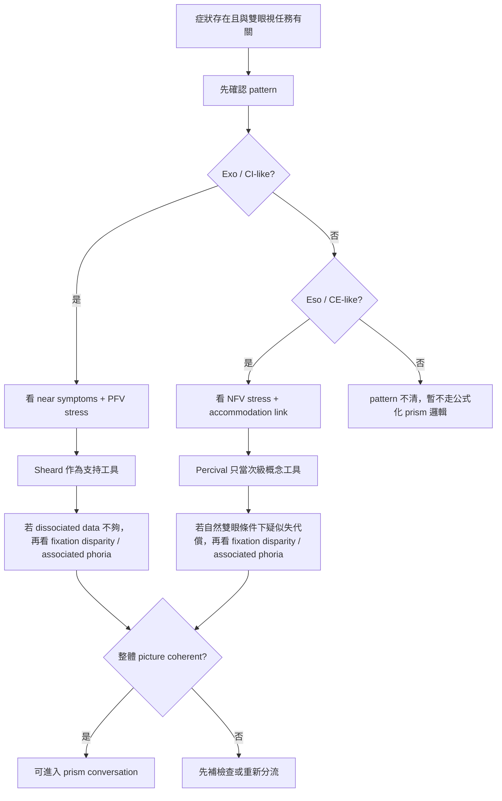

# 外隱斜／內隱斜稜鏡處置判讀板

建立日期：2026-04-13  
用途：把外隱斜與內隱斜的稜鏡處置邏輯，整合成一張可快速判讀的臨床板。

## 先講結論

稜鏡不是因為有法則就開，而是因為：

- 症狀有意義
- pattern 合理
- binocular stress 有證據
- 沒有更高層級紅旗

## 外隱斜側

### 最常用的思考順序

1. 先確認是不是 exo / CI-like pattern
2. 再看 near symptoms 是否強
3. 再看 PFV 是否不足或明顯吃緊
4. `Sheard's criterion` 拿來當支持工具
5. 若 dissociated data 不夠解釋症狀，再看 fixation disparity / associated phoria

### 外隱斜時 Sheard 怎麼放

Sheard 最適合放在這個位置：

- 不是處方命令
- 是「這個 exo pattern 的 stress 是否真的過大」的輔助判斷

最穩的用法是：

- exo symptom pattern 明確
- PFV stress 明顯
- rule support 同方向

## 內隱斜側

### 最常用的思考順序

1. 先確認是不是 eso / CE-like pattern
2. 看 NFV 是否吃緊
3. 看 accommodation-vergence relationship
4. `Percival's criterion` 只能當次級概念工具
5. 若 picture 不完整，不要公式化開 prism

### 內隱斜時 Percival 怎麼放

Percival 可以幫你想「range balance 是否失衡」，
但它不夠強，不能單獨當內隱斜處方硬規則。

## Mallett / fixation disparity / associated phoria 放在哪

這一層最好的定位是：

- 當主訴真實存在
- dissociated phoria 不足以說明不適
- 你懷疑病人在自然雙眼條件下失代償

它最不好的用法是：

- 拿來直接代替整個 BV workup
- 拿來無視症狀與其他量測

## 臨床整合板

| 區塊 | 外隱斜 | 內隱斜 | 臨床定位 |
|------|--------|--------|----------|
| 主 pattern | exo / CI-like | eso / CE-like | 先決條件 |
| 主要 stress | PFV 壓力 | NFV 壓力 | 生理負擔判讀 |
| 第一法則 | Sheard | Percival | 只當輔助，不是命令 |
| 自然條件補強 | fixation disparity / associated phoria | fixation disparity / associated phoria | 當 dissociated findings 不夠時補上 |
| 最大風險 | 只看 rule 就開 prism | 只看 rule 就開 prism | 公式化錯誤 |
| 何時該升級分流 | tropia / incomitance / sudden diplopia / neuro red flags | tropia / incomitance / sudden diplopia / neuro red flags | 不能只當功能性 BV |

## 決策流程圖

## 臨床提醒

1. 外隱斜時，Sheard 比 Percival 更常有臨床存在感，但仍不是唯一依據。
2. 內隱斜時，最常見錯誤是直接拿 Percival 當處方定律。
3. fixation disparity / associated phoria 很有價值，但它們最怕被單獨神化。
4. OEP 的價值比較像是幫你理解病人為什麼會失衡，不是代替量測。

## 可對病人怎麼講

「稜鏡不是單純把眼位往某個方向推而已，而是看你現在的兩眼合作是不是已經超過負荷。如果有些檢查顯示你真的在硬撐，稜鏡才有討論價值。」
