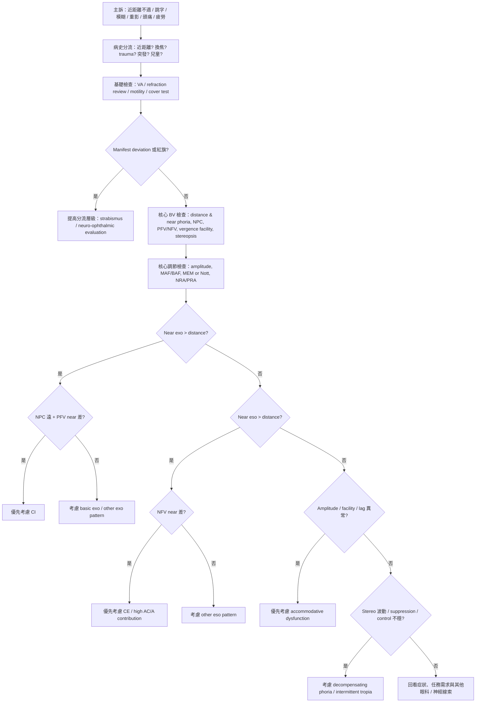

# 雙眼視機能分析流程圖

建立日期：2026-04-13

```mermaid
flowchart TD
    A["主訴：近距離不適 / 跳字 / 模糊 / 重影 / 頭痛 / 疲勞"] --> B["病史分流：近距離? 換焦? trauma? 突發? 兒童?"]
    B --> C["基礎檢查：VA / refraction review / motility / cover test"]
    C --> D{"Manifest deviation 或紅旗?"}
    D -->|是| E["提高分流層級：strabismus / neuro-ophthalmic evaluation"]
    D -->|否| F["核心 BV 檢查：distance & near phoria, NPC, PFV/NFV, vergence facility, stereopsis"]
    F --> G["核心調節檢查：amplitude, MAF/BAF, MEM or Nott, NRA/PRA"]
    G --> H{"Near exo > distance?"}
    H -->|是| I{"NPC 遠 + PFV near 差?"}
    I -->|是| J["優先考慮 CI"]
    I -->|否| K["考慮 basic exo / other exo pattern"]
    H -->|否| L{"Near eso > distance?"}
    L -->|是| M{"NFV near 差?"}
    M -->|是| N["優先考慮 CE / high AC/A contribution"]
    M -->|否| O["考慮 other eso pattern"]
    L -->|否| P{"Amplitude / facility / lag 異常?"}
    P -->|是| Q["優先考慮 accommodative dysfunction"]
    P -->|否| R{"Stereo 波動 / suppression / control 不穩?"}
    R -->|是| S["考慮 decompensating phoria / intermittent tropia"]
    R -->|否| T["回看症狀、任務需求與其他眼科 / 神經線索"]
```

## 用法

這張圖不是拿來取代臨床判斷，而是提醒自己：

- 先分流，再深測
- 先看 pattern，再談 diagnosis
- 先確認有沒有紅旗，再把它當功能型雙眼視問題
